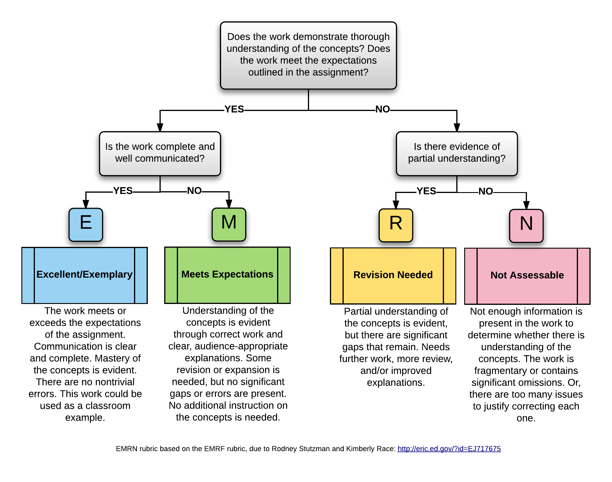

 ---
title: "Syllabus for Organic Chemistry 2"
subtitle: "CHEM 128B, Fall 2020 (Virtual Classroom)"
author: "Instructor: Hubert Muchalski, Ph.D."

header-includes:
- \usepackage[document]{ragged2e}
---

# TL;DR

- I want you to succeed. Your classmates want you to succeed. 
- Organic chemistry is a hard subject to master, especially as an intense summer course.
- This course uses mastery grading system. There are no points and no partial credit. 
- It doesn't matter what textbook you use but official text (Klein 4 ed) has some perks.
- The course is designed around _flipped learning_ model.
- Your learning will be measured with quizzes (LTAs), written assignments (AEPs), and a final exam (multiple choice).

# Start here

Welcome to the second semester of course in organic chemistry (CHEM 128B)! I'm Hubert Muchalski, a professor in Department of Chemistry and Biochemistry. Before reading any further, here are some things to know:

1. **I want you to be successful in this course.** I will do my utmost to help you do this, by creating and maintaining a learning environment based on challenge and support. "Success" in the course is more than just good grades. It means that you are being challenged to grow as a learner, that you are engaging actively with tasks that feed your growth, and that you are doing your best work by solving challenging organic chemistry problems. It also means that you are building your lifelong learning skills so that once the course is over, you are better and stronger as a learner and can continue to learn new things independently.
2. **College-level chemistry is more than just memorizing structures and reactions**. On the pathway to success as outlined above, you will be asked to do more than just give answers to problems. Your task is to seek deep understanding of underlying concepts and working on explaining of the outcomes of chemical reactions and properties of organic molecules.
3. **Expect to be challenged intellectually throughout this course.** None of these elements of success come easily. They require a great deal of time and attention to properly deal with ambiguity of the concepts and tasks in the course. This will require you to leave your comfort zones on a regular basis. You will need to stay engaged by participating in class meetings and on the class discussion board---asking questions, seeking understanding, and giving help.
4. **Intellectual struggle is normal and healthy in a challenging course.** You can expect at times to feel like you are really struggling with the material, even if learning in earlier chemistry courses came easy. This is a normal and healthy experience. Legitimate struggle is actually a sign you are doing things right, training your mind beyond what it is capable at the moment. My goal is to support you in this process. 
5. **You have a lot of help available to you as you work.** Throughout the semester, you will be given a lot of support to help you rise to the challenge. I will do my best to be available for consultations. You're not alone in this so please engage with your classmates, ask questions, seek clarification but also be provide help whenever you can. https://fresnostate.zoom.us/j/84121183466?pwd=OTB4N25QV0owOUNCcTE1QkVCR3VWUT09

# Course information

- **Course name and number (units)**: CHEM 128B (75500 02-LEC) (3 Units)
- **Pre-requisite**: Passed CHEM 128A with grade "C" or better.
- **Meetings**: Mon–Thu 9:00--11:00 am on Zoom (registration link on Canvas)
<!-- - **Instructor office**: Science 1 room 352 -->
- **Office Phone**: (559) 278-2711 (redirects to my cell phone)
- **Email**: [hmuchalski@csufresno.edu](hmuchalski@csufresno.edu) or [hmuchalski@mail.fresnostate.edu](hmuchalski@mail.fresnostate.edu) (they go to the same inbox). Usually, my response time is *within 12 hours of reading the message*. We also have online course tools where you can ask questions to the entire class at any time, making it more likely to get a quick response.
- **Office Hours**: Appointments can be scheduled through calendar function "Find Appointments" on Canvas.

# Introduction

Carbon-based molecules are central to a host of chemical and biological processes because of their broad range of structure and reactivity. The millions of organic compounds alone, ranging from polymers to pharmaceuticals, make the field important for study. Yet organic chemistry is also a highly integrated discipline that impacts and is impacted by the other branches of chemistry and other sciences. Indeed organic chemistry enables a molecular understanding of physicochemical phenomena in materials science, the environment, biology, and medicine. Because the field has reached a high level of integration with these areas, progress in organic chemistry continues at a fast pace and much more remains to be discovered. 

The goal of this course is to drive the student to appreciate the breadth of organic chemistry by facilitating an understanding of the principles, and the practice of applying them, to gain a working knowledge and appreciation of organic structure and reactivity. The second semester in the sequence also emphesizes that our only way to molecular knowledge is through experimentation; correlating structure with reactivity and function through wet chemical methods, spectroscopy, and use of computational simulations.

# Learning objectives

It is expected that you come to this course already familiar with concepts and skills introduced in CHEM 128A and you are able to:

* communicate the structure and reactivity of organic molecules using drawing and naming conventions;
* analyze bonding and its consequences on molecular structure and reactivity of organic molecules; 
* analyze the interplay between electronic, steric, and orbital interactions to predict the behavior and properties of organic molecules and reactive intermediates;

Concepts and skills listed above will be further developed and reinforced in CHEM 128B. Upon successful completion of CHEM 128B students will be able to:

* predict products, infer substrates, and propose reagents needed to complete a chemical reactions; 
* use spectroscopic data to deduce the structure of the molecule.
* use retrosynthetic analysis to plan multi-step synthesis of target molecules; and 
* use curved arrow notation to depict organic reaction mechanisms including addition, elimination, substitution, rearrangement, functional group interconversions and redox transformations. 

## Course materials and technology

This course is part of the Immediate Access program. All students have access to a digital version of the textbook and associated materials on the first day of class. Students who wish to purchase course materials on their own can opt-out before their account is automatically charged on the 10th day (5th day for Summer courses) of instruction. Contact the Kennel Bookstore for more details.

- **Textbook:** "Organic Chemistry" online textbook with integrated Study Guide and Solutions Manual by David Klein 4th edition published by Wiley (via Immediate Access). It is okay to use prior editions of the textbook but you may not have the access to the WileyPLUS platform (see below).
- **WileyPLUS:** Online learning platform and homework. WileyPLUS is integrated with Canvas and all links to assignments and materials will be posted on Canvas. [^WileyPLUS-version]
+ **A personal computer**: running Windows or macOS, that can run desktop applications and has a reliable access to high-speed internet. A tablet device is an acceptable alternative, but the online homework platform is not optimized for mobile devices.
+ **A modern web browser**: Chrome is the recommended browser by Fresno State IT. Other browsers such as Edge, Firefox, or Safari are likely to work just as well but the support will be limited.
- **Canvas:** The central repository for all course materials and information found here: [https://fresnostate.instructure.com](https://fresnostate.instructure.com).
+ **Zoom:** Virtual class meetings will be held via Zoom. Links and passwords to zoom meetings will be published on Canvas. Make sure your Zoom client is up to date.
+ **Document scanning tool**: Many assignments in this course are designed to be prepared by hand on paper. Few people own document scanners nowadays, but a mobile device with a scanning app can do a sufficient job at converting paper documents into PDFs. There are number of options available for both iOS and Android. Find one that you like and learn how to use it.
+ **Active Fresno State network account** so that you can access email, Canvas, and Google Suite. If you have any issue with accessing any of the above, please let me know as soon as possible. We will use a variety of additional course tools during the semester, but they will be free to use, and you will be taught how to use them as part of the class.

[^WileyPLUS-version]: WileyPLUS version must be the same as the official edition of the textbook (4th ed.). If you opt out of Immediate Access and buy the textbook and access to WileyPLUS through other means, make sure that your access code is for the 4th edition of the textbook.

# Structure of the course

I designed this course according to the flipped learning model, an instructional philosophy optimized for active learning. Direct instruction is done before class meetings through structured activities and class time is repurposed for collaborative work on creative applications. This [video series](https://vimeo.com/showcase/8484250) highlights the basics for getting started with flipped learning.

**Before class**, your task will be to review previously covered material, and get familiar with the basic concepts of the upcoming lesson. Not all new material needs formal instruction. Information is abundant and you can learn the basics on your own (with guidance from the instructor). 

**Class time** will be structured around agile lesson plans that aim to operate within middle third of [Bloom taxonomy](https://flic.kr/p/LQuqT2). There may be some small lectures or tutorials, but active work will be the main component since the best way to learn organic chemistry is by doing lots of problems. We will have Zoom conference calls on the days/times the class is scheduled. The sessions will be recorded, but it is in your best interest to attend live class meetings.

**After class** you must continue to engage with the material through deliberate practice and deliberation on the ideas discussed in class until you're ready to show mastery by attempting Learnint Target Assessment (LTA). 

## Learning activities and assessments

You will be engaging with several kinds of activities in the course, both to facilitate learning of the material and to demonstrate how well you have learned it. The course uses a *mastery-based grading system* in which your work will be required to meet certain levels of quality that demonstrate *mastery*. These include:

2. **Perusall** .
1. **Learning Target Assessments (LTA)** are short tests assessing student learning within one learning objective. There are 12 Learning Targets in the course (see [Appendix A](#appendix-a)), 6 of which are designated as **Core** targets due to their central nature in Organic Chemistry, and the other 6 of which are designated as **Supplemental**. Students get numerous opportunities to demonstrate mastery of the content described in Learning Targets. See ["How work is graded in CHEM 128B"](#grading) below for details how LTAs are scored.
3. **Application/Extension Problems (AEP)** are more challenging integrated problems for which students must clearly communicate a complete solution. AEPs assesses student skills across multiple learning objectives, may require technology, and all will require a formal writeup. Submission and grading of AEPs is discussed in ["How work is graded in CHEM 128B"](#grading) section below.
4. **Final exam** will be on **Monday, July 19th, 2021 at 9:00 am**. The final exam is composed of 70 multiple choice questions designed by experts from the American Chemical Society. The final exam will be administered online via Canvas and the Respondus Lockdown Browser.

# How work is graded in CHEM 128B {#grading}

CHEM 128B uses a mastery-based grading system that is designed to provide you with control over the grading process. The final grade in CHEM 128B will be determined by the quantity and quality of evidence you provide that show you have mastered the course learning objectives. 

## Mastery Checkpoints and scoring of LTAs

Each week we will have *Mastery Checkpoint*, a window of time during which you will have opportunity to attempt LTAs. An exam packet of LTAs will be available on Canvas and you will have 2 hours, from the moment you download the document, to submit your work. *You will only need to attempt problems for Learning Targets that you have not yet mastered*. 

LTAs are scored using a 3-tier scale: 

- green (satisfactory evidence of learning); 
- yellow (shows progress but not mastery); and 
- red (no evidence of learning). 

Each LTA comes with a description of what constitutes acceptable evidence of learning. Work that meets the criteria will be given a *satisfactory* score (green) and will be considered *mastered*. Work that does not meet the criteria can be attempted again at later checkpoint (see the [Revision](revisions) policy for details.

## Scoring of AEPs and the EMRN rubric

Work on Application/Extension Problems (AEPs) is scored not with points but with one of four designation: "E" (Excellent/Exemplary), "M" (Meets the standard), "R" (Needs revision), or "N" (Not assessible/Not enough information). Whenever your work on an AEP is graded, you will be given extensive actionable feedback on what was done well and what needs improvement. The process of assigning these marks is shown on the rubric diagram below:

## Revisions and reassessment {#revisions}

You can reattempt LTAs which you did not master yet at a later *Checkpoint*. AEPs earning M, R, or N can be revised and resubmitted at any time. They will be regraded using the same standards as originally used. 

Only one AEP submission can may be made per week. This can be one new submission, or one revision. A second submission can be purchased with a [token](#tokens) (below) but three or more submissions in a week are not allowed under any cirumstance. Students have to spend a token in order to revise any AEP that was scored as "N" (Not Assessable).

## Tokens {#tokens}

Tokens are a fake currency that are used to "purchase" exceptions to course policies and other advantageous items in the course. Every student starts with four tokens which can be spent for any of the following at any time:

+ submit a second AEP (either revision or new submission) in a given week;
+ revise an AEP scored as "N"; and
+ extend the LTA checkpoint deadline by 1 hour.

Tokens may not be "stacked". For example, by spending 3 tokens to get a 3-hour *Checkpoint* deadline extension.

## Final letter grade

Your course grade is determined using the table below. In order to earn a particular letter grade, each requirement must be met in the column for that grade, **the highest grade for which all the requirements are met**. There are no statistical or numerical adjustments (a.k.a. grading on a curve). Failing grade (F) is given if not all the requirements for a "D" are met.

The mastery-based grading system insists that you show consistent excellence in all assignments in the course. That is, an outstanding work on AEPs, for example, does not “bring up” poor work on LTAs. 

Note: In the table, numerical values indicate the minimum level needed to meet the requirement; amounts above this level also meet the requirement. For AEP's, "M+" means "either M or E".

| Category                           | D    | C    | B         | A        |  
| ---------------------------------- | ---- | ---- | --------- | -------- |  
| Core Learning Targets (6)          | 4    | 6    | 6         | 6        |  
| Supplemental Learning Targets (6)  | 0    | 1    | 3         | 5        |  
| AEPs (4+)                          |      | 1 M+ | 2 M+      | 1 E, 2 M+|  
| Final Exam (70 pts)                | 21   | 28   | 35        | 42       |  

# Course policies

## Technology issues when submitting work

WileyPLUS and ORION assignments are submitted electronically. It is the student’s responsibility to make sure these items are submitted on time, even if technology issues arise. Technology issues that are avoidable or resolved with a simple work-around will not be considered valid grounds for a deadline extension. For example, if you are trying to upload a Lab to Canvas and Canvas won’t accept the file, you should try again later, use different browser, or send the file as an email attachment until you can upload it successfully.

## Academic integrity

Some of the work you will do in the course involves collaboration; at other times collaboration may be allowed but not required; while at others it may not be allowed. Here are the rules for collaboration on each kind of work you do:

+ *Checkpoints* and other work done on Learning Targets: No interations at all with another person or with unauthorized sources on the internet is allowed. Any evidence of using information from another person or source will be investigated as academic dishonesty.
+ *AEPs*: Similarly, no interations at all with another person or with unauthorized sources on the internet is allowed.
+ *WileyPLUS*: You may discuss the general, broad ideas of WeBWorK problems with others but you may not use other people's work as your own.

**Please note:** There is no need to commit academic dishonesty in this class since you can revise and resubmit almost anything. If you come to believe that cheating or plagiarism is necessary given your situation: DON'T DO IT. Get some help instead and take comfort in the fact that you can just submit your best effort, get feedback, and try again later.

All suspected instances of academic dishonesty will be thoroughly investigated, and whether a student has committed academic dishonesty is my determination to make based on the evidence. If I determine academic dishonesty has been committed, a report will be filed with the Dean of Students office, and the minimum penalty will be:

+ grade of "progressing" on Checkpoints and other Learning Target work and required expense of two tokens to reattempt; for severe cases, you may be barred from reattempting.
+ AEP's: A grade of "N", and you will not be allowed to revise or resubmit the AEP for the rest of the semester.  

Note these are *minimum* penalties. Academic dishonesty carries with it strong punitive measures mandated by Fresno State policies, including possible automatic failure of the course or suspension from the university. For details, please see APM 235 by going to [http://www.fresnostate.edu/aps/documents/apm/235.pdf](http://www.fresnostate.edu/aps/documents/apm/235.pdf).

## Intellectual Property

As part of your participation in virtual/online instruction, please remember that the same student conduct rules that are used for in-person classrooms instruction also apply for virtual/online classrooms. Students are prohibited from any unauthorized recording, dissemination, or publication of any academic presentation, including any online classroom instruction, for any commercial purpose. In addition, students may not record or use virtual/online instruction in any manner that would violate copyright law. Students are to use all online/virtual instruction exclusively for the educational purpose of the online class in which the instruction is being provided. Students may not re-record any online recordings or post any online recordings on any other format (e.g., electronic, video, social media, audio recording, web page, internet, hard paper copy, etc.) for any purpose without the explicit written permission of the faculty member providing the instruction. Exceptions for disability-related accommodations will be addressed by Services for Students with Disabilities (SSD) working in conjunction with the student and faculty member.

## Dropping the course

Dates and details on withdrawing from courses are described on the [Admissions web pages](http://fresnostate.edu/studentaffairs/are/registration/add-drop-deadlines.html).

A *serious and compelling reason* is defined as an unexpected condition that is not present prior to enrollment in the course that unexpectedly arises and interferes with a student's ability to attend class meetings and/or complete course requirements. The reason must be acceptable to and verified by the instructor of record and the department chair. The condition must be stated in writing on the appropriate form. The student must provide documentation that substantiates the condition. Failing or performing poorly in a class is not an acceptable "serious and compelling reason" within the University policy, nor is dissatisfaction with the subject matter, class or instructor.

# University policies and disclaimers

In addition to course policies, you are expected to be familiar with Academic Regulations described in the [University Catalog](http://www.fresnostate.edu/catalog/academic-regulations/) as well as policies listed below.

- Class Schedule Policies: [http://fresnostate.edu/studentaffairs/classschedule/policy/](http://fresnostate.edu/studentaffairs/classschedule/policy/)
- Copyright Policy: [http://libguides.csufresno.edu/copyright](http://libguides.csufresno.edu/copyright)
- Students with Dissabilities: [http://fresnostate.edu/studentaffairs/careers/students/interests/disabilities.html](http://fresnostate.edu/studentaffairs/careers/students/interests/disabilities.html)
- Academic Integrity: [http://fresnostate.edu/studentaffairs/studentconduct/academic-integrity/](http://fresnostate.edu/studentaffairs/studentconduct/academic-integrity/)
- Policy on Cheating and Plagiarism: [http://fresnostate.edu/studentaffairs/studentconduct/policies/cheating-plagiarism.html](http://fresnostate.edu/studentaffairs/studentconduct/policies/cheating-plagiarism.html)
- Add/Drop Course: [http://www.fresnostate.edu/studentaffairs/registrar/registration/add-drop-deadlines.html](http://fresnostate.edu/studentaffairs/classschedule/registration/add-drop.html)

# Appendix A: Course Modules

| Week | Module                                         | Text |
|------|------------------------------------------------|------|
|  1   | Course orientation                             |      |
|      | Review of CHEM 128A                            | 1–11 |
|      | Alcohols, phenols, and thiols                  | 12   |
|      | Aldehydes and ketones                          | 19   |
|  2   | Ethers, epoxides, and sulfides                 | 13   |
|      | Conjugated pi systems and pericyclic reactions | 16   |
|      | Structure and properties of aromatic compounds | 17   |
|  3   | Reactions of aromatic compounds                | 18   |
|      | Infrared spectroscopy and mass spectrometry    | 14   |
|  4   | NMR spectroscopy                               | 15   |
|      | Carboxylic acids and their derivatives         | 20   |
|  5   | Enols and enolates                             | 21   |

Chapter 22 (Amines) will be incorporated in parts when relevant chemistry is discussed.

<!-- * Module 1: Review of CHEM 128A (electrophilic addition, nucleophilic substitution, and β-elimination).
* Module 2: Alcohols, phenols, and thiols (Ch12)
* Module 3: Ethers, epoxides, and sulfides (Ch13)
* Module 4: Infrared spectroscopy and mass spectrometry (Ch14)
* Module 5: NMR spectroscopy (CH15)
* Module 6: Conjugated pi systems and pericyclic reactions (Ch16)
* Module 7: Structure and properties of aromatic compounds (Ch17)
* Module 8: Reactions of aromatic compounds (Ch18)
* Module 9: Aldehydes and ketones (Ch19)
* Module 10: Carboxylic acids and their derivatives (Ch20)
* Module 11: Enols and enolates (Ch21)
* Module 12: Amines (Ch22) -->

# Learning Targets{#appendix-a}

## Group E: Electrons and Bonding

Learning Objective: Analyze bonding and its consequences on molecular structure and reactivity of organic molecules.

* E1: **(CORE)** Analyze structure and determine how it relates to stability and reactivity of organic molecules in the light of Brønsted and Lewis acid--base theories
* E2: Construct molecular orbital (MO) diagrams of molecules containing multiple pi bonds. Use MO diagrams to predict the outcome of pericyclic reactions (thermal and photochemical). Classify compounds as aromatic, antiaromatic, or non-aromatic.

## Group R: Reactions and Synthesis

Learning Objective: Predict products, infer substrates, and propose reagents needed to complete a reaction scheme. Plan a multi-step organic synthesis, including retrosynthetic analysis of target molecules. 

* R1: Synthesis and functional group interconversions with alkanes, alkyl halides, alkenes, alkynes, alcohols, and ethers.
* R2 **(CORE)**: Reactions involving conjugated pi systems and aromatic rings
* R3 **(CORE)**: Functional group interconversions involving carbonyl compounds. 
* R4: Reaction involving enols and enolates

## Group M: Mechanisms and Reaction Pathways

Learning Objective: Use curved arrow notation to communicate plausible reaction mechanisms. Evaluate energy diagrams, reactive intermediates, and transition states of competing reaction pathways to predict regio- and stereoselectivity of organic reactions.

* M1: Electrophilic addition, nucleophilic substitution, and β-elimination. 
* M2: Reactions involving aromatic rings
* M3 **(CORE)**: Nucleophilic addition and acyl substitution at carbonyl carbon
* M4 **(CORE)**: Transformations involving enols and enolates

## Group S: Spectroscopy

Learning Objective: Analyze spectroscopic data to determine the structure of a molecule

* S1 **(CORE)**: Analyze IR spectroscopy data to deduce the functional groups present in the analyzed sample. Analyze MS fragmentation data to deduce the structure of the analyzed sample.
* S2: Analyze NMR spectroscopy data to elucidate the structure of organic compounds. 

## AEP 

1. Use combination of spectroscopic data (IR, MS, 1H NMR, 13 NMR) including multiplet analysis to propose a plausible structure of an unknown sample.
2. Multistep synthesis of complex molecular scaffolds

<!-- AEP

- Sharpless asymmetric epoxidation (AEP)
- Autoxidation of ethers (AEP)
- Design a multi-step synthesis that involves substitution on the aromatic ring (AEP)
- Design multi-step synthesis that involves reactions at the benzylic position (AEP)
- Spectroscopic identification of organic compounds using IR, MS, NMR, and UV-vis (AEP)

 -->