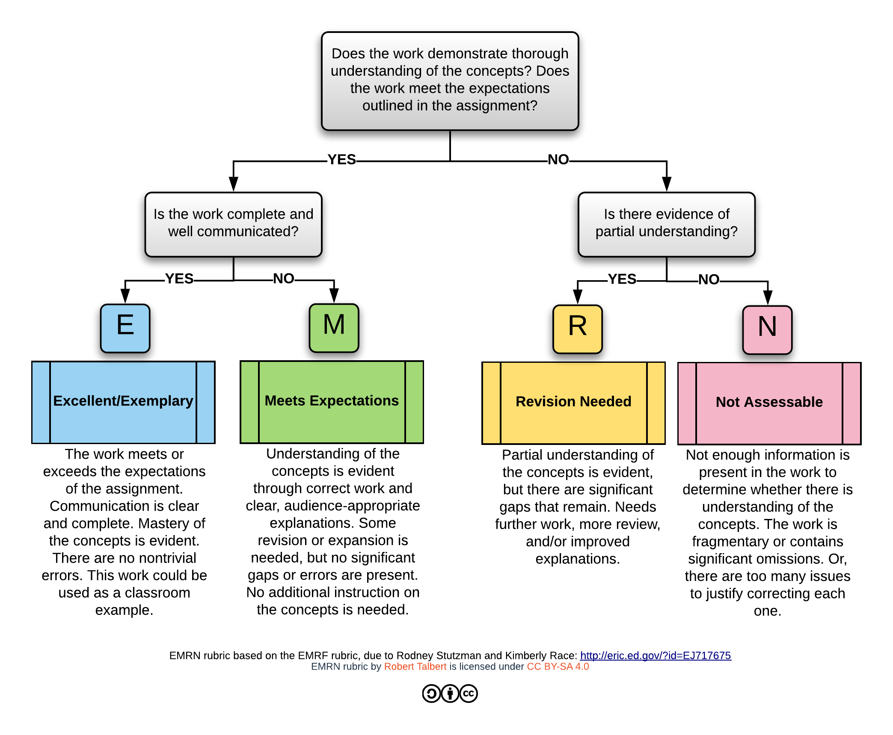

<!-- Canvas Table Styling
Change class of all table opening tags in HTML page before pasting to canvas

<table class="ic-Table ic-Table--condensed ic-Table--striped ic-Table--hover-row" style="width: 600px;"> 
-->

# Course Syllabus (CHEM 129B)

| Course Name  | Organic Chemistry 2 (Laboratory)      |
| :----------- | :------------------------------------ |
| Semester     | AY 25–26 Spring                       |
| Units        | 2                                     |
| Department   | Chemistry and Biochemistry            |
| Time         | MW 1:00–3:50 pm[^1]                   |
| Location     | Science 1-372                         |
| Instructor   | Dr. Hubert Muchalski                  |
| Email        | hmuchalski@mail.fresnostate.edu[^2]   |
| Office       | Science 1, room 352                   |
| Office phone | 559-278-2711                          |
| Office Hours | MW 11:00-11:50 and by appointment[^3] |

[^1]: Typically we will work without a break and finish the lab session after 150 minutes of instruction/supervision, i.e., 3:30 pm. See more details in the [Length of a lab session](#length-of-a-lab-session) section.
[^2]: Please read the [communication policy](#instructor-availability-and-message-responses) for details about instructor availability.  
[^3]: [Schedule an appointment][1-on-1-calendar] using Google Calendar. 

[1-on-1-calendar]: https://calendar.app.google/mUmzNPCnZLXESrCQ8

## Table of Contents <!-- omit from toc -->

- [Course Syllabus (CHEM 129B)](#course-syllabus-chem-129b)
  - [About the course](#about-the-course)
    - [Assumed prior knowledge and skills](#assumed-prior-knowledge-and-skills)
  - [Course Learning Outcomes](#course-learning-outcomes)
  - [Course materials and technology](#course-materials-and-technology)
  - [Course workflow](#course-workflow)
  - [Assessments and grading](#assessments-and-grading)
    - [Grading philosophy](#grading-philosophy)
    - [Grading of experiments](#grading-of-experiments)
    - [Revisions and reattempts](#revisions-and-reattempts)
    - [Research project](#research-project)
    - [Letter grades](#letter-grades)
  - [Safe Chemical Laboratory Practices](#safe-chemical-laboratory-practices)
  - [Policies and disclaimers](#policies-and-disclaimers)
    - [Length of a lab session](#length-of-a-lab-session)
    - [Attendance and make-up policy](#attendance-and-make-up-policy)
    - [Technology issues when submitting work](#technology-issues-when-submitting-work)
    - [Academic integrity](#academic-integrity)
    - [Dropping the course after the census date](#dropping-the-course-after-the-census-date)
    - [Plagiarism detection](#plagiarism-detection)
    - [Intellectual Property](#intellectual-property)
    - [Dispute Resolution](#dispute-resolution)
    - [Student Ratings of Instruction](#student-ratings-of-instruction)
  - [University policies and disclaimers](#university-policies-and-disclaimers)
    - [Links to relevant University Policies](#links-to-relevant-university-policies)
  - [University Services](#university-services)
  - [Appendix A: On keeping records of lab activities](#appendix-a-on-keeping-records-of-lab-activities)
    - [Lab notes guiding principles](#lab-notes-guiding-principles)
  - [Appendix B: Rubrics](#appendix-b-rubrics)
    - [Lab readiness](#lab-readiness)
    - [Risk assessment rubric](#risk-assessment-rubric)
    - [Lab notebook rubric](#lab-notebook-rubric)
    - [Experimental results rubric](#experimental-results-rubric)
    - [Grading of lab reports and the EMRN rubric](#grading-of-lab-reports-and-the-emrn-rubric)
    - [Research report and presentation](#research-report-and-presentation)

## About the course

This course aims to inspire students to explore the breadth of organic chemistry, fostering an understanding of its principles and their practical application. The course goal is to equip students with a functional knowledge and genuine appreciation of organic structure and reactivity. In the second semester of the sequence, the emphasis shifts towards the pivotal role of experimentation in gaining molecular insights. This involves correlating molecular structure, reactivity, and function using wet-chemical methods and spectroscopy.

CHEM 129B is the second part of the 2-semester sequence in organic chemistry laboratory. As such, it primarily introduces intermediate-level concepts and techniques used in organic chemistry. We will continue to use the techniques covered in the first-semester lab and introduce additional methods, such as NMR spectroscopy, multi-step synthesis, green chemistry, and chemical literature.

### Assumed prior knowledge and skills

The formal prerequisite to enroll in CHEM 129B is passing CHEM 129A (or equivalent) with a grade of "C" or better. In practice, it means that students who enroll in CHEM 129B should be able to:

- communicate the structure and properties of organic molecules using standard drawing and naming conventions;
- conduct laboratory work of high quality, including handling chemicals and other laboratory hazards in a safe, ethical, and socially responsible manner;
- use basic laboratory techniques such as extraction, crystallization, filtration, distillation, column chromatography, TLC, and
- measure the melting point and acquire the IR spectrum of a sample.

## Course Learning Outcomes

Upon completion of this course, students will be able to:

- Construct scientific explanations of their observations and results. Rationalize observations by selecting appropriate models for their systems and understand the limitations of models and theories.
- Keep and maintain an effective laboratory notebook/record that would allow a chemist (having a similar level of training) to reproduce the results.
- Select or design a separation or purification method based on the physical and chemical properties of compounds in a mixture.
- Use standard laboratory equipment and instruments and evaluate the reliability and significance of laboratory data, all within professional ethical guidelines.
- Use online databases to find relevant research articles containing information such as physical and chemical properties of organic molecules, synthetic procedures, and spectroscopic data.
- Carry out an experimental procedure to synthesize, isolate, purify, and analyze the product of chemical synthesis.
- Interpret spectroscopic data of organic compounds to confirm the structure of organic compounds.
- Draw effective 2-D structures using ChemDraw and present data in graphs and tables.
- Communicate the results of experiments to the instructor and peers in written form (lab report) and presentation (slide deck or poster).

For more details, refer to the Department Student Learning Outcomes modeled after [ACS Guidelines for Bachelor's Degree Programs][ACS-guidelines].

[ACS-guidelines]: https://www.acs.org/education/policies/acs-approval-program/guidelines.html
[techniques-manual]: <https://chem.libretexts.org/Bookshelves/Organic_Chemistry/Book:_Organic_Chemistry_Lab_Techniques_(Nichols)>

## Course materials and technology

- **Techniques Manual.** [LibreTexts e-book by Lisa Nichols][techniques-manual] is our recommended reference for laboratory techniques. You may see another text listed for this course, authored by Pavia. We are phasing it out, but if you own a copy of Pavia's textbook (5th or 6th edition), feel free to use it in addition to the LibreTexts option.
- **Organic Chemistry Textbook.** "Organic Chemistry: A Tenth Edition" by John McMurry [accessible online through OpenStax][openstax-mcmurry].
- **Personal protective equipment (PPE).** Lab coat and approved safety goggles. Disposable nitrile gloves will be provided.
- **Canvas.** The central repository for all course materials and information is our [Canvas site][cnvs], which will serve as the central hub for assignments, grades, and links to materials/resources.
- **Binder.** Three-ring binder to hold lab notebook pages. After years of trying different things (bound notebooks, Blue Books, etc.) This is the best solution for recording student experiment notes.
- **Document scanning tool.** Most documents you will turn in for feedback and grading will be submitted electronically, but prepared on paper. A smartphone with a scanning app can be used to convert paper documents into PDFs. There are several free options available for both iOS and Android. Find one that you like and learn how to use it.
- **Personal computer.** You will need a x86 class personal computer[^4] that can run standalone desktop applications. 
- **ChemDraw.** Leading app for drawing structures, reactions, diagrams, and more. The department purchased a multi-user license. The instructor will provide instructions on obtaining and activating the software.
- **MestReNova (mNova).** Leading app for processing and analyzing spectroscopic data. We will use it to convert raw spectrometer data into professional spectra. The department purchased a multi-user license. The instructor will provide instructions on obtaining and activating the license.

[^4]: Chromebooks and iPads are powerful devices, but are not x86-class computers. They can't run ChemDraw or MestReNova (at least not yet).  

[openstax-mcmurry]: <https://openstax.org/books/organic-chemistry/pages/dedication-and-preface>

## Course workflow

Activities in this course follow a cyclical pattern. Over the semester, you will engage in two experimental modules and an independent research project. At the heart of each module is a synthesis of an organic compound (1–3 steps). The instructor will communicate specific requirements at the beginning of the semester.

**Before class**, your task will be to prepare for the experiment by studying the relevant reactions and mechanisms, lab techniques, and safety information about the chemicals you will be working with. Your instructor may assign a graded pre-lab assignment to help you prepare for the lab.

**Class time** will be primarily focused on conducting experiments, making observations, generating results, processing spectroscopic data, and group discussions. Results and observations made during the lab are essential inputs for writing post-lab reports. For example, not making a key observation or obtaining poor-quality data may reduce your grade on the experiment because you will not have all the information to write the lab report or discuss the results.

**After class**, you will work on finalizing the documentation related to the experiment, usually in the form of a typed lab report. Details for each post-lab assignment will be posted on Canvas by the instructor. Document templates will be available for formal lab reports.

## Assessments and grading

The final grade in the course will be based on your work in three areas (see table below). There will be four experiment sets, an independent project, and quizzes. Each experiment set will include a variety of graded work (pre-lab, lab notebook, report, and other assignments).

| Assignment Category        | %Weight  |
| :------------------------- | :------- |
| Safety quiz & onboarding   | 2%       |
| Literature workshop        | 5%       |
| Spectroscopy               | 13%      |
| Acetonide experiment group | 20%      |
| Maleimide experiment group | 20%      |
| Research Project           | 40%      |
| **Total**                  | **100%** |

### Grading philosophy

>[!NOTE]
> Grading in this course is different from what you might be used to. Please read this section carefully and ask questions as needed.

As a teacher and learner, I firmly believe that *learning takes time* and that grading your work based on a single data point, such as a single quiz or test, is inaccurate, invalid, and perhaps unethical. A truly valid measure of learning has to involve *multiple attempts* that allow you to learn from your past mistakes and demonstrate not only your skill, but also your growth. I believe your work should be evaluated just like everyone else's in the real world, i.e., by providing you with *clearly defined standards* for quality, *detailed verbal feedback* on your work, and *opportunities to try again* based on that feedback. This gets you into a *feedback loop*, a conversation between you and me about your work, that continues until your work meets the standards (or we reach the end of the semester). In light of the principles outlined above, students can *revise and resubmit some of their work* several times over if needed, using the feedback at each stage to improve and grow.

### Grading of experiments

You will receive feedback and marks on the work you produce in and out of the lab. Those include pre-lab documentation, experimental notes and observations, results (yield, spectroscopic data), and a written lab report. Each regular experiment contributes 20% to the final grade and will include several components (see the table below for details).

| Item                   | Weight | Revisable? |
| :--------------------- | :----- | :--------- |
| Lab readiness          | 6%     | Yes        |
| In-lab notes & results | 8%     | No         |
| Lab report             | 5%     | Yes        |

### Revisions and reattempts

Lab readiness assignments (pre-lab) and lab reports are revisable. Lab readiness assignments will be due in advance of the lab session and can be revised and resubmitted before experimental work begins. 

Lab reports will be due after the lab session and can be revised and resubmitted once. The initial attempt will receive verbal or written feedback, and you can use this feedback to make corrections and/or improvements as needed. Revisions will also have a deadline, usually 1 week after the original submission is returned with feedback and are submitted to the same assignment area as a original version. 

Lab reports will come with a deadline for initial submissions. You must submit a complete, good-faith effort on the assignment before the deadline to be eligible to revise or resubmit it. Examples of situations where revision would not be allowed include the following:

- The assignment is not submitted at all before the deadline (In other words, you cannot revise an assignment you did not turn in).
- The assignment is submitted, but is incomplete. Parts of the assignment are skipped or omitted, either partially or entirely, or include responses stating something like "I didn't know how to do this part," but without a good faith attempt at producing a solution.

### Research project

During the second half of the semester, students will engage in an independent research project, a CURE (Course-based Undergraduate Research Experience). The instructor will not provide the project's objective and methods, and the outcomes are either entirely unknown or only partially revealed. To accomplish the project, students will conduct comprehensive literature research to gather the essential information required for the synthesis. The culmination of this endeavor will involve delivering a presentation to the class.

### Letter grades

The final grade will be determined based on overall performance, according to the weights in the table above.

| Grade | Total Score |
| :---- | :---------- |
| A     | 90--100%    |
| B     | 80--89%     |
| C     | 70--79%     |
| D     | 60--69%     |
| F     | <60%        |

## Safe Chemical Laboratory Practices

1. NO food or drink in the laboratory.
2. Wear clothing appropriate for laboratory work.
3. Select and correctly use appropriate Personal Protective Equipment (PPE).
4. Know what to do and whom to contact in an emergency in the laboratory.
5. Avoid distractions and be alert to and aware of your surroundings and potential hazards in your area.
6. Maintain a safe and clean work area.
7. Only conduct experiments or procedures approved by your lab instructor or research advisor.
8. Understand the common chemical hazards and hazards specific to the chemicals and procedures with which you are working.
9. Understand and follow best practices on how to handle, transport, store, and dispose of chemicals safely.
10. If any equipment, glassware, or procedures are not working correctly or as expected, notify your instructor before proceeding.
11. Notify your instructor if you have, develop, or may develop any medical conditions (e.g., severe asthma, limited mobility, vision impairment, pregnancy, etc) that may affect your safety in the laboratory or sensitivity to chemicals, so that your instructor can properly advise or accommodate you on minimizing the risks associated with laboratory work.

These principles will be discussed in detail during the first week of class. More information can be found here: [https://goo.gl/1UFRbo](https://goo.gl/1UFRbo). Also, refer to [*Guidelines for Chemical Laboratory Safety in Academic Institutions*](https://www.acs.org/content/dam/acsorg/about/governance/committees/chemicalsafety/publications/acs-safety-guidelines-academic.pdf) published by the American Chemical Society.

## Policies and disclaimers

### Length of a lab session

The CSU defines *one class hour* as 50 minutes of instruction, which is the default duration for a 1-unit lecture. Science laboratories fall under the category of *supervision courses* ([C16 classification](https://academics.fresnostate.edu/scheduling/documents/CourseClassificationSystem%201.3.18.pdf)). For laboratory sessions, 1 unit corresponds to *3 class hours*, totaling 150 minutes (2 hours and 30 minutes) of instruction/supervision. The class duration listed in the catalog (2 hours and 50 minutes) includes a 10-minute break every 50 minutes of instruction.

Adhering to a fixed time frame in a lab setting is challenging because students work at their own pace, often in groups, and imposing fixed break times might be impractical or even unsafe. The nature of experimental work is such that there is plenty of time when you wait. You can take a short break during idle time as long as it is safe to do so.

Thus, unless otherwise announced, we will work without a break and finish the lab session after 150 minutes of instruction/supervision, i.e., at 11:30 am for morning sections and 3:30 pm for afternoon sections.

### Attendance and make-up policy

Students are expected to attend and actively participate in all class sessions. If you are absent from class, it is your responsibility to check on announcements made while you were away. The course attendance policy follows the University's [APM 232: Policy on Student Absence](http://www.fresnostate.edu/academics/facultyaffairs/documents/apm/232.pdf). Late assignments will not be accepted for a grade unless the absence meets the University's policy guidelines. Excuses and exceptions will be interpreted in light of the APM 232.

### Technology issues when submitting work

For assignments submitted electronically, it is your responsibility to make sure they are submitted on time, through any means necessary, even if technology issues arise. If a tech issue arises, it is your responsibility to find another way to get it to the instructor (for example, via an email attachment). Technology issues that are avoidable or resolved with a simple workaround will not be considered valid grounds for a deadline extension. For example, if you are trying to upload a Lab to Canvas and Canvas won't accept the file, you should try again later or send the file as an email attachment until you can upload it successfully.

### Academic integrity

This course is subject to [Standards of Student Conduct](https://studentaffairs.fresnostate.edu/studentconduct/academic-integrity/), [The Code of Academic Integrity](http://www.fresnostate.edu/academics/facultyaffairs/documents/apm/236.pdf), and [APM 235: Policy on Cheating and Plagiarism](http://www.fresnostate.edu/aps/documents/apm/235.pdf). Every student is responsible for reading and understanding these policies, especially the consequences for engaging in academically dishonest activities.

None of these policies should be necessary because there's no need to be academically dishonest thanks to the revision/resubmission policy. Rather than engage in academic dishonesty and put your entire career at risk, turn in your best, complete, good-faith effort on assignments. And then, if revisions are needed, you'll typically get the chance.

> [!IMPORTANT] TL;DR
> When you submit work on an assignment in this class, it must be your ideas and your voice, and not someone else's or those of an AI. Anything else is subject to severe penalties required by the University.

Any action or behavior that misrepresents one's contributions to or the results of any scholarly product submitted for credit, evaluation, or dissemination will be considered academic misconduct. For example:

- *Cheating*: Attempting to use materials, information, or aids that have not been authorized by the instructor for academic work.
- *Collusion*: Unauthorized collaboration with another person in preparing academic assignments offered for credit, and collaboration with another person to violate any section of the rules on academic misconduct. Generative AI tools such as ChatGPT are included in the definition of "another person".
- *Dual submission*: Submitting work that has been previously graded, or is being submitted concurrently to more than one course, without authorization from the instructor of the class to which the student wishes to submit. (This especially applies to those who are repeating CHEM 129B.)
- *Plagiarism*: Appropriation of, buying, receiving as a gift, or obtaining by any means material that is attributable in whole or in part to another source without any indication or citation of the source, including words, sentences, ideas, illustrations, structure, computer code, and other expression or media, and presenting that material as one's own academic work being offered for credit or in conjunction with a program, course, or degree requirements.

Please note that this is not a complete list, and note that **enabling others** to engage in academic misconduct may be considered as a form of academic misconduct.

### Dropping the course after the census date

A *serious and compelling reason* is defined as an unexpected condition that is not present before enrollment in the course that unexpectedly arises and interferes with a student's ability to attend class meetings and/or complete course requirements. The reason must be acceptable to and verified by the instructor of record and the department chair. The condition must be stated in writing on the appropriate form. The student must provide documentation that substantiates the condition.

Failing or performing poorly in a class is not an acceptable "serious and compelling reason" within the University policy, nor is dissatisfaction with the subject matter, class, or instructor.

### Plagiarism detection

The campus subscribes to Turnitin, a plagiarism prevention service, through Canvas. You will need to submit written assignments to Turnitin. Student work will be used for plagiarism detection and for no other purpose. The student may inform the instructor in writing that they refuse to participate in the plagiarism detection process, in which case the instructor may use other electronic means to verify the originality of their work. Turnitin Originality Reports WILL NOT be available for your viewing.

### Intellectual Property

All course materials (the syllabus, quiz questions, exam questions, and assignments) and content created by the instructor are the property of the instructor and the University. Students are prohibited from posting course materials online (e.g., Course Hero) and from selling course materials to or being paid for providing materials to any person or commercial firm without the express written permission of the professor teaching this course. Doing so will constitute both an academic integrity violation and a copyright violation. Audio and video recordings of class lectures are strictly prohibited unless I provide you with explicit permission in advance. Students with an official letter from the Services for Students with Disabilities office may record the class if SSD has approved that service. Otherwise, recordings of lectures are included in the intellectual property notice described above.

### Dispute Resolution

If you have any questions or concerns about this course that you and I are unable to resolve, please feel free to contact the department chair to discuss the matter.

- Chair's name: Dr. Eric Person
- Department name: Chemistry and Biochemistry
- Chair's email: <eperson@csufresno.edu>
- Department phone number: 559-278-2103

### Student Ratings of Instruction

In the final weeks of the semester, you will be asked to complete a short survey to provide feedback about this class. The primary goal of student ratings is to help your instructor improve the class. The department chair and the college dean will also review feedback. You will be given 15 minutes of class time to complete student ratings. Please offer input honestly and thoughtfully. Your participation is appreciated. You can access your student rating surveys and get more information at: <https://sites.google.com/mail.fresnostate.edu/fresno-state-sri/fssri-for-students>.

## University policies and disclaimers

### Links to relevant University Policies

- Class Schedule Policies: [http://fresnostate.edu/studentaffairs/classschedule/policy/][1]
- Copyright Policy: [https://library.fresnostate.edu/about/policies/copyright-policy][2]
- Academic Integrity and Honor Code: [http://www.fresnostate.edu/academics/facultyaffairs/documents/apm/236.pdf][4]
- Policy on Cheating and Plagiarism: [http://fresnostate.edu/studentaffairs/studentconduct/policies/cheating-plagiarism.html][5]
- Add/Drop course: [http://www.fresnostate.edu/studentaffairs/registrar/registration/][6]
- Disruptive classroom behavior: [http://www.fresnostate.edu/academics/facultyaffairs/documents/apm/419.pdf][8]

[1]: http://fresnostate.edu/studentaffairs/classschedule/policy/
[2]: https://library.fresnostate.edu/about/policies/copyright-policy
[4]: http://www.fresnostate.edu/academics/facultyaffairs/documents/apm/236.pdf
[5]: http://fresnostate.edu/studentaffairs/studentconduct/policies/cheating-plagiarism.html
[6]: http://www.fresnostate.edu/studentaffairs/registrar/registration/ "Add/Drop Course"
[7]: https://www.fresnostate.edu/catalog/academic-regulations/index.html#computerreq "Computer requirements"
[8]: http://www.fresnostate.edu/academics/facultyaffairs/documents/apm/419.pdf "Disruptive classroom behavior"

## University Services

- [Associated Students, Inc.][aef8ae07]
- [Students with Disabilities][SSD]
- [Dream Success Center][a7e41318]
- [Library][library]
- [Learning Center Information][0896546b]
- [Student Health and Counseling Center][820f4ac6]
- [SupportNet][SupportNet]
- [Survivor Advocacy][fresnostate 4]
- [Writing Center][b17a5bde]

[aef8ae07]: https://studentaffairs.fresnostate.edu/asi/index.html "ASI"
[a7e41318]: http://fresnostate.edu/studentaffairs/dsc/index.html "Dream Success Center"
[0896546b]: http://fresnostate.edu/studentaffairs/lrc "Learning center"
[820f4ac6]: https://www.fresnostate.edu/studentaffairs/health/ "Student Health and Counseling Center"
[b17a5bde]: http://www.fresnostate.edu/artshum/writingcenter/ "Writing Center"
[cnvs]: https://fresnostate.instructure.com/courses/106137
[SSD]: http://fresnostate.edu/studentaffairs/ssd/
[library]: https://library.fresnostate.edu/
[SupportNet]: https://studentaffairs.fresnostate.edu/lrc/supportnet/index.html
[fresnostate 4]: https://studentaffairs.fresnostate.edu/survivoradvocate/

## Appendix A: On keeping records of lab activities

The human brain is both the least reliable whiteboard and the least dependable alarm clock. It's crucial to acknowledge that memories of your actions and observations in the lab can fade rapidly once you step away. To counteract this, it's essential to document your experiences in real time, as these notes (combined with pre-lab documentation) will serve as the foundation for your subsequent post-lab tasks, such as reports and presentations.

Maintain a comprehensive record of what you did and observed. Also, keep all physical copies such as IR and NMR spectra, gas chromatograms, and sketches of TLC plates. These components contribute to your experimental record. Remember that your lab notes are subject to evaluation at any time and should remain up to date. Your instructor will provide guidelines for maintaining your laboratory notebook at the start of the semester. Be prepared to submit your in-lab notes for assessment before concluding your time in the lab. your time in the lab.

### Lab notes guiding principles

Lab notes should document what you did and how, what you observed, and the data you collected. To know what to write and not to write in the notebook is a balancing act of relevance and brevity. You need to write down details that are relevant and necessary for someone to reproduce your work. This hypothetical chemist will not be able to consult with you or access any auxiliary documentation you had access to while conducting the experiment. Therefore, you need to describe what you did and how.

It is safe to assume, however, that the reader of your notes has been trained in the basic organic laboratory techniques. For example, you don't have to explain how to do a recrystallization because the reader who will should know how to carry out recrystallization (and if not, they can refer to a techniques manual). What will be helpful to them are the details relevant to this particular recrystallization: the solvent used, the approximate volume of solvent, and the time it took to cool and grow crystals.

Lab notes should be easy to read—use paragraph breaks, headings, etc. to help the reader navigate the notebook.

Contrary to common belief, reproducible, detailed lab notes don't have to be long or take a lot of time or effort to produce. Below is an example statement that captures all critical information about purification of the crude material, yield, and the appearance of the final product:

> "The crude product (sticky brown solid, 1.23 g) was recrystallized from hot ethanol (15 mL) in an Erlenmeyer flask. After cooling to rt and then to 0 °C, the solid was collected by vacuum filtration, washed with ice-cold water, and dried in air for 1 h to give the product as a white crystalline solid (0.38 g), mp 87–89 °C."

An additional benefit of writing it all down in real time is that it can help you track down errors, explain unexpected outcomes, and/or troubleshoot the experiment that went wrong. In the recrystallization described above, the mass recovery is quite poor, and a chemist repeating the experiment may decide to use less ethanol (or a different solvent) to improve mass recovery.

## Appendix B: Rubrics

### Lab readiness

- **Satisfactory (4)**: Prelab documentation (stoichiometry table, calculations, etc) is complete, accurate, and conveys the student's readiness to carry out the experiment.
- **Progressing (2**): Prelab documentation (stoichiometry table, calculations, etc) is complete but contains errors or inaccuracies. The errors don't compromise students' readiness to carry out the experiment.
- **Incomplete (0**): Prelab documentation was not submitted, OR the submitted material is incomplete, contains critical errors, or significant inaccuracies that compromise the student's readiness for the experiment.

### Risk assessment rubric

- **Complete (2)**: Hazard and risk assessment is complete, accurate, and relevant to the experiment. Significant risks and hazards are identified, and a safety recommendation is provided. Errors are insignificant or inconsequential
- **Progressing (1)**: Hazard and risk assessment is provided, but significant gaps remain, the safety information is inaccurate or irrelevant to the experiment, and it is increasing the risk of exposure to hazards.
- **Incomplete (0)**: Safety information is not provided, OR the information provided significantly increases the risk of exposure to hazards.

### Lab notebook rubric

The notes will allow others to reproduce the work. The notes include observations and communicate what was done, how, when, and by whom. For more details, read [Appendix A: On keeping records of lab activities](#appendix-a-on-keeping-records-of-lab-activities).

- **Fully reproducible (4)**: The notes are complete and easy to navigate. The record is complete, i.e., a person unfamiliar with the experiment is highly likely to obtain similar results. Errors are insignificant or inconsequential.
- **Somewhat reproducible (3)**: The notes are complete and moderately easy to navigate. The included information and experimental details contain gaps, i.e., only a person who is familiar with the experiment is likely to obtain similar results.
- **Reproducibility compromised (2)**: The notes don't include all the necessary information needed to repeat the experiment. Significant omissions and errors are present. Even a person familiar with the experiment is unlikely to obtain similar results.
- **Not reproducible (1)**: The copy of the lab notes was not submitted, the notes are incomplete, or not helpful. A person familiar with the experiment is unlikely to obtain similar results.

### Experimental results rubric

- **Reasonable (4)**: Product obtained with reasonable yield and purity.
- **Somewhat reproducible (3)**: Product obtained, but either yield or purity is compromised.
- **Reproducibility compromised (2)**: Product obtained, but both yield and purity are severely compromised.
- **Not reproducible (1)**: No product was obtained.

### Grading of lab reports and the EMRN rubric

One of the main objectives of this course is for you to learn to interpret and communicate experimental results. This is a complex skill that needs to be developed over time through iteration and feedback loops. Each experiment will end with the submission of a written lab report, which will be evaluated using the "EMRN" rubric shown below.

Each lab report can be revised and resubmitted before the grade becomes final. Deadlines and conditions for submission of revised reports will be communicated in Canvas.

- Grade "E" or "M" receives a full score (6)
- Grade "R" will receive a partial score (4) with an option to revise and resubmit.
- Grade "N" will receive a partial score (2) with an option to revise and resubmit, but the feedback will be minimal.
- No report will receive no credit (0). Submissions after the deadline will be reviewed as-is, with no possibility of revision or resubmission.

### Research report and presentation

Written reports and oral presentations will be evaluated using the [ELIPSS rubric](https://drive.google.com/file/d/1ZAL5_sTpci3waFMQVWRrhFqTF9uOIwv9/view?usp=sharing). Enhancing Learning by Improving Process Skills in STEM (ELIPSS) is an NSF-funded project that focuses on identifying, developing, and assessing process skills (also known as professional skills, practical skills, workplace skills, transferable skills, or soft skills) in active learning in undergraduate STEM classrooms. Assessing process skill development and providing feedback to students and instructors is a key component for enhancing these skills in STEM programs.
